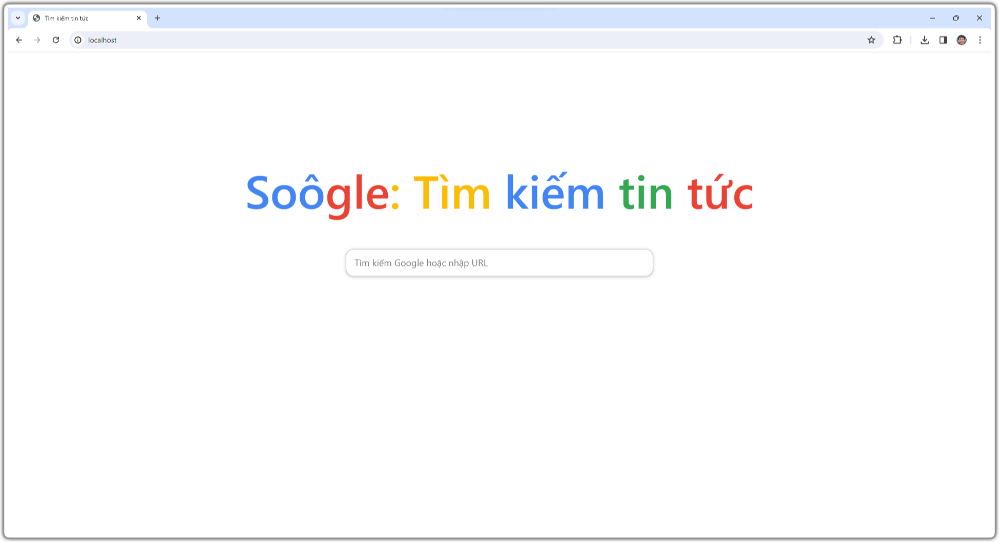
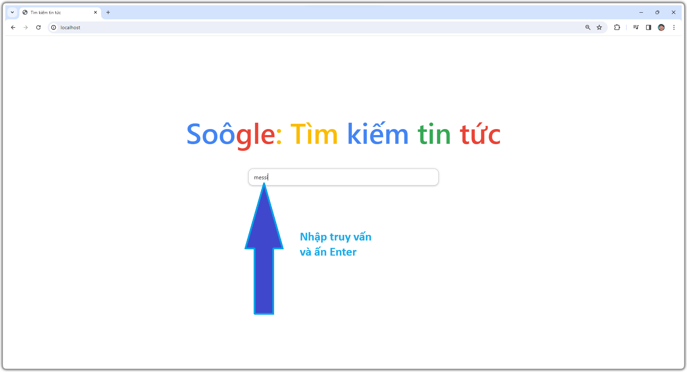
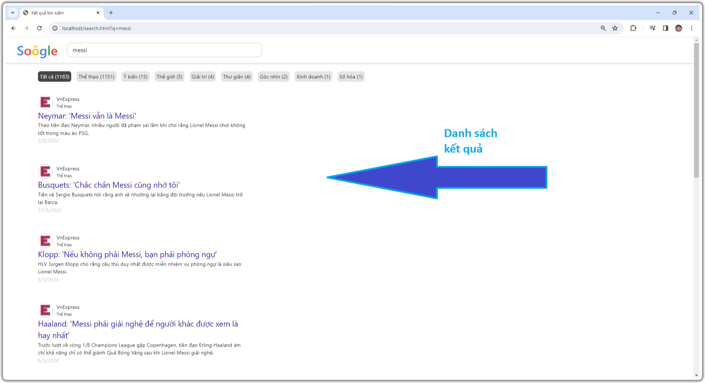
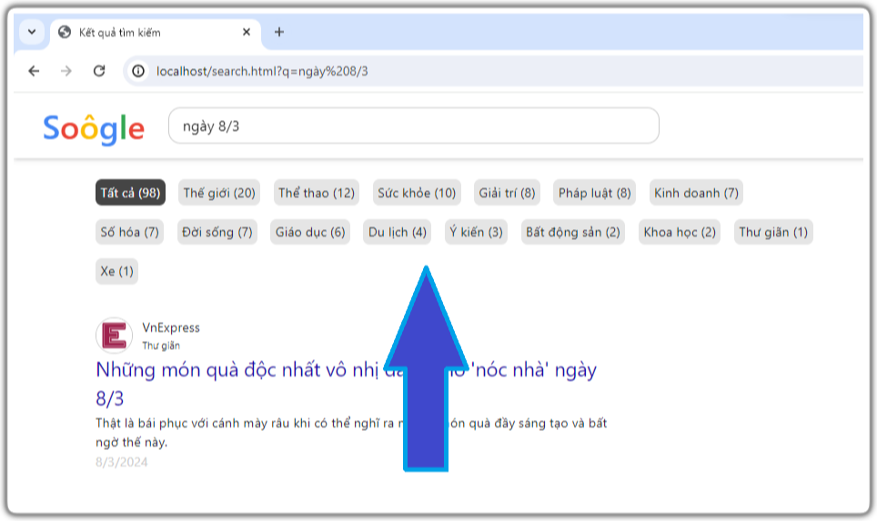
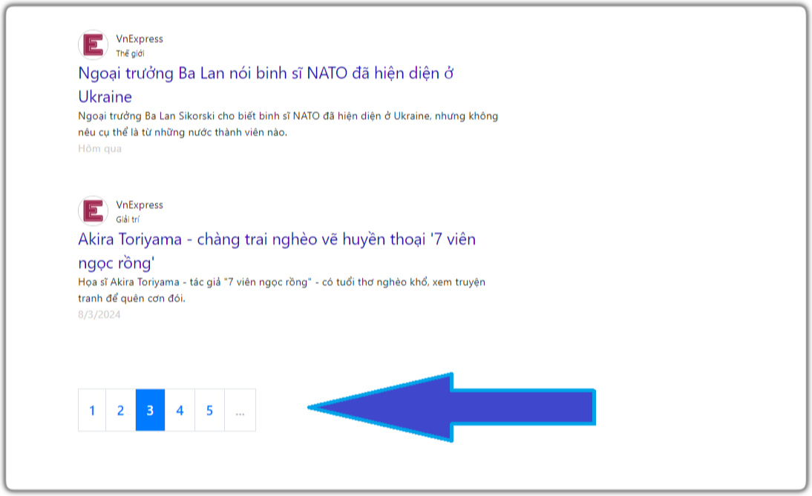
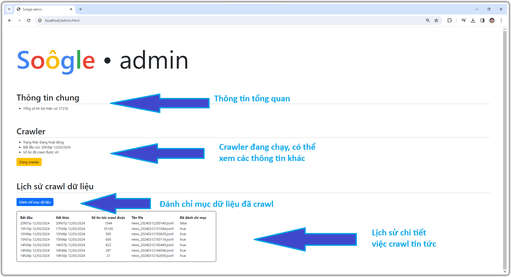

# News-Search-Engine: A complete news search system
Project này xây dựng hệ thống tìm kiếm tin tức hoàn chỉnh, từ khâu crawl dữ liệu, đánh chỉ mục dữ liệu cung cấp giao diện và xử lý truy vấn người dùng. Các công nghệ sử dụng bao gồm:
- Scrapy: Crawl dữ liệu tin tức, cụ thể là tin tức từ trang [vnexpress](https://vnexpress.net/).
- Apache Solr: Dùng để đánh chỉ mục tin tức và xử lý truy vấn người dùng. Trong quá trình đánh chỉ mục và xử lý truy vấn có sử dụng thư viện [VnCoreNLP](https://github.com/vncorenlp/VnCoreNLP) để tách từ tiếng Việt.
- Django: Cung cấp API cho giao diện người dùng.
- Jquery: Làm giao diện, xử lý logic web.

# Hướng dẫn cài đặt
Trước khi bắt đầu, hãy đảm bảo rằng máy của bạn đã được cài đặt git và Docker. Việc cài đặt Docker vô cùng đơn giản và bạn có thể tìm thấy hướng dẫn ở bất kỳ đâu.
```
$ git clone https://github.com/hung-itb/News-Search-Engine.git
$ cd News-Search-Engine
$ docker-compose up -d
```
Chú ý tại bước clone project về sẽ khá lâu, vì project khá nặng. Project chứa thư viện [VnCoreNLP](https://github.com/vncorenlp/VnCoreNLP) (167 MB)..

Sau khi thực hiện xong các bước, có thể thử truy cập vào [http://localhost](http://localhost/) để xem kết quả. Nếu hiển thị như hình bên dưới thì việc cài đặt đã thành công.

<p align="center"></p>

Tuy nhiên hiện tại chưa có dữ liệu gì hết, bạn có thể vào giao diện [admin](http://localhost/admin.html) để chạy crawler và đánh chỉ mục tin tức từ đầu để sử dụng. Tuy nhiên làm thế này sẽ hơi tốn thời gian, vậy nên hãy làm theo các bước sau để khởi tạo dữ liệu nhanh chóng:
- Dừng các container của project trong giao diện Docker.
- Trong thư mục **News-Search-Engine** mới tạo, hãy xóa thư mục **data**.
- Tải file [zip](https://drive.google.com/file/d/1GYI93KqkEORKi0A-T5eA3bw-C6ttK1mV/view?usp=sharing) (88 MB) này về, đây là dữ liệu khởi tạo từ trước cho project.
- Giải nén file zip ra, tìm thư mục tên **data**, dán nó vào trong thư mục **News-Search-Engine**
- Khởi động lại project với lệnh ```docker-compose up -d```.

# Các chức năng của trang web
## 1. Tìm kiếm tin tức
Tất nhiên rồi, đây là chức năng chính của trang web này. Tại trang [http://localhost](http://localhost/), bạn nhập truy vấn của mình vào ô input và ấn Enter, trang web sẽ đưa bạn đến giao diện trang kết quả như hình bên dưới:

<p align="center"></p>
<p align="center"></p>

Nhìn rất giống danh sách kết quả tìm kiếm của Google đúng không. Tất nhiên rồi, không những giao diện mà ngay cả cái tên **Soôgle** cũng được lấy cảm hứng từ **Google** mà.

Mỗi kết quả sẽ đi kèm với tiêu đề và mô tả ngắn về tin tức. Khi bạn bấm vào các đường link thì sẽ được đưa tới bài báo gốc của **vnexpress**.

## 2. Phân loại kết quả và Phân trang kết quả

**Phân loại kết quả**

<p align="center"></p>

**Phân trang kết quả**

<p align="center"></p>

## 3. Quản lý dữ liệu như admin

Truy cập vào giao diện admin tại [http://localhost/admin.html](http://localhost/admin.html). Tại đây bạn có thể:
- Xem được tổng số tin tức hiện có
- Quản lý crawler: Xem thông tin, Khởi động hoặc Tắt
- Xem lịch sử crawl dữ liệu, quản lý việc đánh chỉ mục các tin tức

<p align="center"></p>

Khi mình push code lên đây thì đã có sẵn hơn 30000 tin tức rồi, bạn nào muốn có thể mở crawler lên cho nó chạy đẻ có nhiều tin tức hơn. Trong máy mình, crawler cào được đến hơn 1 triệu tin tức cơ. 

Càng về sau thì crawler sẽ càng chậm, bởi vì crawler được viết để cào web tĩnh và tìm kiếm các tin tức khác nhờ các đường link trong trang. Vậy nên sẽ có thời điểm crawler không thể cào được nữa, và phải chờ sang ngày mới để cào số lượng ít ỏi mới.

**Lưu ý**: Sau khi đã crawl được một lượng tin tức kha khá (mình thì tầm 20000), thì request gửi tới vnexpress sẽ bị chặn hết. Vậy nên phải đổi mạng để crawl tiếp, hoặc như mình thì bật **1.1.1.1** lên thì lại bình thường.

## Cơ chế xếp hạng tin tức

Hệ thống sự dụng độ đo BM25 để đánh giá độ phù hợp của một từ đối với một tin tức. Tuy nhiên một tin tức sẽ có 3 trường thông tin **title**, **abstract**, **content**, vậy nên độ phù hợp của một từ đối với tin tức sẽ là tổng có trọng số của độ phù hợp của từ này với các trường thông tin kia.

Hơn nữa các nếu từ được xét là chuỗi ngày tháng thì độ phù hợp của nó với tin tức sẽ được nhân lên thêm một hệ số nữa so với các từ khác.

Cuối cùng, vì đây là hệ thống tìm kiếm tin tức nên hệ thống sẽ đánh hệ số cao cho các tin tức được đăng gần đây nhất.

# Tags
- Information Retrieval
- Tìm kiếm thông tin
- HUST
- Tìm kiếm tin tức
- IT4863
- Apache Solr
- News search engine
